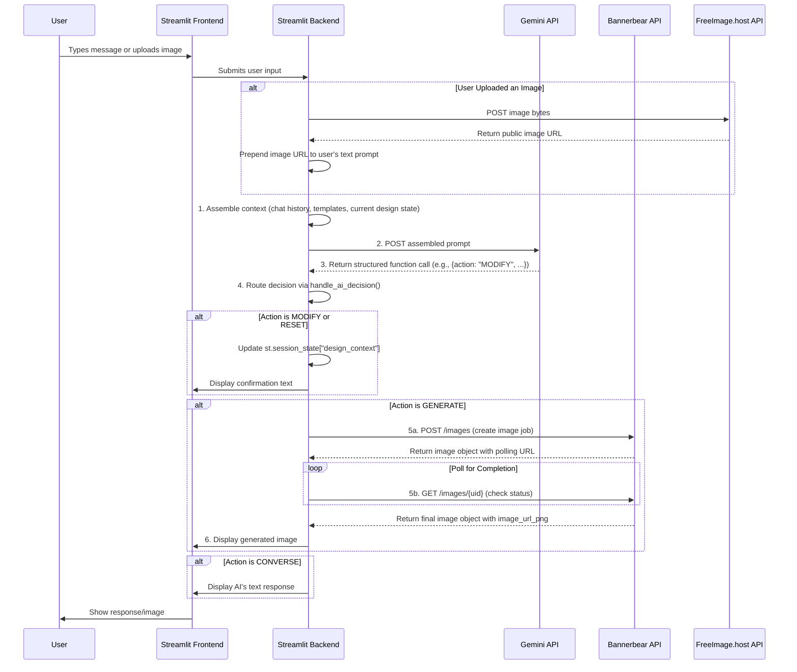

# AI Design Assistant - Technical Documentation

The AI Design Assistant is a sophisticated, conversational web application designed to automate the creation of marketing materials for Realty of America. It provides a user-friendly chat interface where users can describe their design needs in natural language. The application interprets these requests, intelligently selects design templates, populates them with provided data, and generates high-quality images on demand.

This document serves as a complete technical guide for developers, detailing the application's workflow, architecture, API integrations, and a line-by-line breakdown of the codebase.

## Table of Contents
1.  [Core Features](#1-core-features)
2.  [System Architecture & Workflow](#2-system-architecture--workflow)
    -   [Workflow Diagram](#21-workflow-diagram)
    -   [Detailed Workflow Explanation](#22-detailed-workflow-explanation)
3.  [Codebase Deep Dive](#3-codebase-deep-dive)
    -   [`chatbot_app.py`](#31-chatbot_apppy)
    -   [`gemini_helpers.py`](#32-gemini_helperspy)
    -   [`bannerbear_helpers.py`](#33-bannerbear_helperspy)
    -   [`image_uploader.py`](#34-image_uploaderpy)
    -   [`ui_helpers.py`](#35-ui_helperspy)
4.  [API Integration Details](#4-api-integration-details)
    -   [Google Gemini API](#41-google-gemini-api)
    -   [Bannerbear API](#42-bannerbear-api)
    -   [FreeImage.host API](#43-freeimagehost-api)
5.  [Setup and Running](#5-setup-and-running)
    -   [Prerequisites](#51-prerequisites)
    -   [Installation](#52-installation)
    -   [Running the Application](#53-running-the-application)

## 1. Core Features

-   **Conversational Interface**: Users interact with a familiar chat UI to make design requests.
-   **Natural Language Understanding (NLU)**: The system comprehends complex requests like "Create a 'Just Sold' flyer for 123 Main St, list price $500k, with 3 beds and 2 baths."
-   **Intelligent Template Matching**: The AI autonomously analyzes the user's goal (e.g., 'new listing', 'open house') and selects the most suitable template from a pre-approved set in Bannerbear.
-   **Stateful, Iterative Design**: The application remembers the context of the current design. Users can add or change details in subsequent messages (e.g., "Okay, now add the agent's name: John Doe").
-   **Dynamic Image Generation**: Once all details are provided, the user can ask to see the result, and the system generates a high-resolution PNG image via the Bannerbear API.
-   **On-the-Fly Style Changes**: If a user dislikes a generated design's layout, they can ask for a "new style." The AI will select a different, appropriate template and re-apply all previously provided information.
-   **Integrated Image Uploader**: A sidebar utility allows users to upload their own images (property photos, agent headshots), which are then incorporated into the design.

## 2. System Architecture & Workflow

The application's workflow is a carefully orchestrated sequence of events between the user, the Streamlit backend, and external APIs.

### 2.1. Workflow Diagram



### 2.2. Detailed Workflow Explanation

1.  **User Interaction**: The user enters a prompt in the chat input or uses the sidebar to upload a file. The Streamlit frontend captures this event.
2.  **Image Handling (If Applicable)**: If a file was uploaded, the backend function `upload_image_to_freeimage` is called. It sends the image bytes to FreeImage.host, receives a public URL in return, and formats a special prompt for the AI (e.g., "Image context: ... Their text command is: ..."). The staged file is then cleared.
3.  **Context Assembly**: The main `chatbot_app.py` script gathers all necessary context for the AI:
    *   The user's final prompt.
    *   The recent conversation history (`st.session_state.messages`).
    *   A full JSON dump of all available Bannerbear templates, including their layers (`st.session_state.rich_templates_data`).
    *   The current state of the design being worked on (`st.session_state.design_context`).
4.  **AI Invocation**: This entire package is sent to the Gemini model via the `generate_gemini_response` function. The model is constrained by a detailed system prompt that forces it to respond with a specific structured "function call."
5.  **Decision Routing**: The AI's response is not free-form text; it's a JSON object specifying an `action` and its `arguments`. The `handle_ai_decision` function in `chatbot_app.py` acts as a central router, executing the correct logic based on the `action` received:
    *   **`MODIFY`**: Updates the `design_context` in the session state with new or changed text/image layers.
    *   **`GENERATE`**: Triggers the Bannerbear image creation flow. It calls `create_image` to start the job and then `poll_for_image` to wait for the result.
    *   **`RESET`**: Clears the `design_context` to start a fresh design.
    *   **`CONVERSE`**: Simply forwards the AI's generated text response.
6.  **UI Update**: The placeholder in the Streamlit UI is updated with the final output—be it a confirmation message, a generated image rendered via Markdown, or a conversational reply. The response is also appended to the chat history.

## 3. Codebase Deep Dive

### 3.1. `chatbot_app.py`

This is the main executable file. It orchestrates the entire application, managing the UI, state, and control flow.

-   **`load_all_template_details()`**:
    -   **Purpose**: To fetch comprehensive data for every available Bannerbear template upon application startup.
    -   **Logic**: It first calls the Bannerbear `/templates` list endpoint. Then, it iterates through the summary list, calling `get_template_details` for each template UID to get the full layer information.
    -   **Caching**: Decorated with `@st.cache_resource`, ensuring this expensive network operation runs only once per session.
    -   **Function Calls**: `requests.get()`, `get_template_details()`.

-   **`initialize_session_state()`**:
    -   **Purpose**: To set up the initial state of the application in `st.session_state`. This is crucial for maintaining context across user interactions.
    -   **State Variables**:
        -   `messages`: The chat history.
        -   `gemini_model`: The initialized Gemini model object.
        -   `rich_templates_data`: The result from `load_all_template_details()`.
        -   `design_context`: A dictionary holding the `template_uid` and `modifications` for the current design project.
        -   `staged_file`: Holds the bytes of an uploaded image, ready for the next prompt.
    -   **Function Calls**: `get_gemini_model()`, `load_all_template_details()`.

-   **`generate_image_from_context()`**:
    -   **Purpose**: A dedicated helper to handle the complete image generation process when triggered.
    -   **Logic**: It reads the `template_uid` and `modifications` from the session state, initiates the image creation, polls for the result, and formats a Markdown string containing the final image URL. It also includes user-friendly spinner and error messages.
    -   **Function Calls**: `create_image()`, `poll_for_image()`.

-   **`handle_ai_decision(decision: dict)`**:
    -   **Purpose**: The central router that interprets the AI's structured command and executes the corresponding action.
    -   **Parameters**: `decision` - A dictionary parsed from the Gemini function call's arguments.
    -   **Logic**: It uses an if/elif structure to check the `action` key in the `decision` dictionary.
        -   `CONVERSE`/`RESET`: Returns the `response_text` and may modify session state.
        -   `MODIFY`: Intelligently merges new modifications from the AI into the existing `design_context`. It uses a dictionary lookup to update or add new layers, preventing duplicates.
        -   `GENERATE`: Calls the `generate_image_from_context()` function.
    -   **Function Calls**: `generate_image_from_context()`.

-   **Main Script Body**:
    -   Initializes the app and checks for critical data (`rich_templates_data`). If templates fail to load, the app halts with an error.
    -   Renders the sidebar `st.file_uploader`. When a file is uploaded, its bytes are stored in `st.session_state.staged_file`.
    -   Displays the existing chat history.
    -   The `if prompt := st.chat_input(...)` block is the main interaction loop. It captures new user input.
    -   It checks for a `staged_file`, calls `upload_image_to_freeimage` if present, and constructs the `final_prompt_for_ai`.
    -   It then calls `generate_gemini_response` with all the assembled context.
    -   It parses the response from Gemini, checking if it's a `function_call` or a plain `text` response, and routes it to `handle_ai_decision` accordingly.
    -   Finally, it displays the result in a placeholder and appends it to the `messages` history.

### 3.2. `gemini_helpers.py`

This module is responsible for all communication with the Google Gemini API.

-   **`get_gemini_model(api_key: str)`**:
    -   **Purpose**: Initializes the `GenerativeModel` and configures it with the application's primary tool.
    -   **Logic**:
        1.  Configures the `genai` library with the API key.
        2.  Defines a `genai.protos.FunctionDeclaration` named `process_user_request`. This declaration is a schema that tells the AI exactly what "tool" it has available and what arguments that tool accepts (`action`, `template_uid`, `modifications`, `response_text`).
        3.  Instantiates the `gemini-1.5-flash` model, passing the defined tool in the `tools` list. This enables the model's function-calling capabilities.
    -   **Returns**: An initialized `genai.GenerativeModel` object.

-   **`generate_gemini_response(...)`**:
    -   **Purpose**: To construct the final prompt and send the request to the Gemini API.
    -   **Logic**: This function's most critical component is the `context_prompt` (the "system prompt"). This multi-paragraph string gives the AI its persona, its rules, its available actions, and all the data it needs to make a decision.
    -   **Prompt Engineering**: The prompt is meticulously engineered with sections for:
        -   **Action Definitions**: Explicitly defines `MODIFY`, `GENERATE`, `RESET`, `CONVERSE`.
        -   **Critical Rules**: Contains specific instructions for handling multi-part updates, image uploads (instructing the user to use the uploader), intelligent template selection, and what to do when no template matches.
        -   **Scenarios**: Details how to handle refinements vs. requests for a new style.
        -   **Reference Data**: The `json.dumps()` of `rich_templates_data` and `current_design_context` are injected directly into the prompt, giving the AI real-time data to work with.
    -   **Conversation History**: It assembles a `conversation` list, starting with the system prompt, a canned "I understand" response from the model, and the last 8 turns of the actual user/assistant chat history.
    -   **API Call**: It calls `model.generate_content(conversation)` to get the AI's response.

### 3.3. `bannerbear_helpers.py`

A client library for interacting with the Bannerbear API.

-   **`list_templates(api_key)`**: A simple wrapper for the `GET /v2/templates` endpoint.
-   **`get_template_details(api_key, template_uid)`**: A wrapper for the `GET /v2/templates/{template_uid}` endpoint.
-   **`create_image(api_key, template_id, modifications)`**:
    -   **Purpose**: To start an image generation job.
    -   **Logic**: Sends a `POST` request to `/v2/images` with the template UID and the list of modifications.
    -   **Returns**: The initial image object from Bannerbear, which includes a `self` URL for polling and a `status` of "pending".
-   **`poll_for_image(api_key, image_object)`**:
    -   **Purpose**: To wait for a pending image generation job to complete.
    -   **Logic**: It enters a `while` loop that continues as long as the image `status` is not "completed". Inside the loop, it waits for 1 second, then makes a `GET` request to the `polling_url`. It checks if the status has become "failed" to exit early.
    -   **Returns**: The final, completed image object (containing the `image_url_png`) or `None` if it failed.

### 3.4. `image_uploader.py`

A utility for handling user image uploads.

-   **`upload_image_to_freeimage(image_bytes)`**:
    -   **Purpose**: To get a public URL for an image provided by the user. This is necessary because the AI cannot access local files.
    -   **Logic**:
        1.  Base64-encodes the input image bytes.
        2.  Sends a `POST` request to the FreeImage.host API with the required payload (API key, base64 data).
        3.  Parses the JSON response and extracts the direct image URL.

### 3.5. `ui_helpers.py`

Contains simple functions to improve the UI.

-   **`inject_css()`**: Injects a block of custom CSS into the Streamlit app for styling the typing indicator.
-   **`typing_indicator()`**: Returns the raw HTML for the three-dot bouncing animation.

## 4. API Integration Details

### 4.1. Google Gemini API

-   **Model**: `gemini-1.5-flash`
-   **Key Feature**: **Function Calling**. The application's logic is entirely dependent on this feature. Instead of generating free-form text, the model is instructed to call the `process_user_request` function with specific arguments, turning the LLM into a structured decision-making engine.
-   **Authentication**: Bearer token authentication via the `genai.configure(api_key=...)` method.

### 4.2. Bannerbear API

-   **Endpoints Used**:
    -   `GET /v2/templates`: To get a list of all available design templates.
    -   `GET /v2/templates/{uid}`: To get the detailed layer structure of a specific template.
    -   `POST /v2/images`: To create a new image generation job.
    -   `GET /v2/images/{uid}`: To poll for the status of a generation job.
-   **Authentication**: Bearer token in the `Authorization` header (`"Authorization": f"Bearer {api_key}"`).

### 4.3. FreeImage.host API

-   **Endpoint Used**: `POST /api/1/upload`
-   **Purpose**: A simple, key-based API to host user-uploaded images temporarily so they have a public URL that can be passed to the Bannerbear API for inclusion in a design.
-   **Authentication**: API key sent as a field in the POST request body (`'key': API_KEY`).

## 5. Setup and Running

### 5.1. Prerequisites

-   Python 3.8+
-   API keys for:
    -   Google AI Studio (Gemini)
    -   Bannerbear

### 5.2. Installation

1.  **Clone the repository:**
    ```bash
    git clone <repository-url>
    cd <repository-directory>
    ```

2.  **Create and activate a virtual environment:**
    ```bash
    # For Unix/macOS
    python3 -m venv venv
    source venv/bin/activate

    # For Windows
    python -m venv venv
    .\venv\Scripts\activate
    ```

3.  **Install dependencies:**
    Create a `requirements.txt` file with the following content:
    ```
    streamlit
    requests
    python-dotenv
    google-generativeai
    ```
    Then, install the packages:
    ```bash
    pip install -r requirements.txt
    ```

4.  **Configure environment variables:**
    Create a file named `.env` in the project root. Add your API keys:
    ```env
    BANNERBEAR_API_KEY="your_bannerbear_api_key"
    GEMINI_API_KEY="your_gemini_api_key"
    ```

### 5.3. Running the Application

Once the setup is complete, you can start the Streamlit application with the following command:

```bash
streamlit run chatbot_app.py
```

The application will open in a new tab in your web browser.
